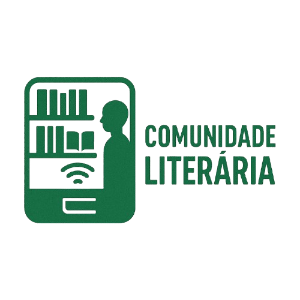

# Comunidade Literária - Padrões de Projeto



Projeto acadêmico desenvolvido para a disciplina de Padrões de Projeto, implementando diversos padrões de projeto em um sistema de biblioteca comunitária com armário automatizado integrado.

## Sobre o Projeto

Sistema de biblioteca comunitária que oferece:
- Empréstimo e doação de livros
- Sistema de créditos e recompensas
- Interface moderna para usuários e moderadores
- Armário automatizado com leitor de QR Code

## Padrões de Projeto Implementados

| Padrão | Arquivo | Descrição |
|--------|---------|-----------|
| Singleton | `utils.py` (DatabaseSingleton) | Garante uma única instância do banco de dados |
| Strategy | `utils.py` (QRCodeProcessor) | Processamento diferente para cada tipo de QR Code |
| Factory | `utils.py` (LivroFactory) | Criação centralizada de objetos Livro |
| Observer | `utils.py` (Logger) | Registro de eventos do sistema |
| Template Method | `utils.py` (CSVManager) | Estrutura comum para manipulação de CSV |
| State | `qr_interface.py` | Controle dos estados da interface de leitura |
| Facade | `utils.py` (CreditSystem) | Interface simplificada para o sistema de créditos |

## Tecnologias

- Python
- Flask
- OpenCV (para leitura de QR Codes)
- Tkinter (para interface de leitura)
- CSV (como banco de dados simplificado)

## Como Executar

1. Clone o repositório:
   ```bash
   git clone [https://github.com/merlin-ribeiro/Comunidade-Literaria.git]
2. Instale as dependências:
   ```bash
   pip install -r requirements.txt
3. Execute a aplicação:
   ```bash
    python app.py
3. Execute o leitor/armário:
   ```bash
    python qr_interface.py
4. Acesse no navegador:
   ```bash
    http://localhost:5000
   
## Credenciais de Teste

- Usuário:
  - Email: usuario1@exemplo.com/usuario2@exemplo.com
  - Senha: 12345
- Moderador:
  - Email: moderador@exemplo.com
  - Senha: 12345
    
( Para certeza de um bom funcionamento da função moderador, mude manualmente o campo 'tipo' do usuário desejado em usuarios.csv )

## Projeto de Disciplina

Este projeto foi desenvolvido como trabalho prático para a disciplina de Padrões de Projeto ministrada pelo professor Katyusco. O objetivo foi aplicar na prática os principais padrões de projeto estudados em sala de aula, demonstrando seus benefícios em um sistema real.

## Diagramas

1 - Diagrama de estados
*lembrar de  colocar
2 - Diagrama UML
*lembrar de colocar IMPORTANTE DEMAIS

## Time
Merlin de Souza Ribeiro Filho - 202211250009 - ribeiro.filho@academico.ipb.edu.br
Felipe Vasoncelos - matriculafelipe - emailfelipe

Instituto Federal de Ciência e Tecnologia da Paraíba, Campus Campina Grande - IFPB/CG
Engenharia de Computação
Padrões de Projetos - Dr. Katyusco de Farias Santos
2025
  
